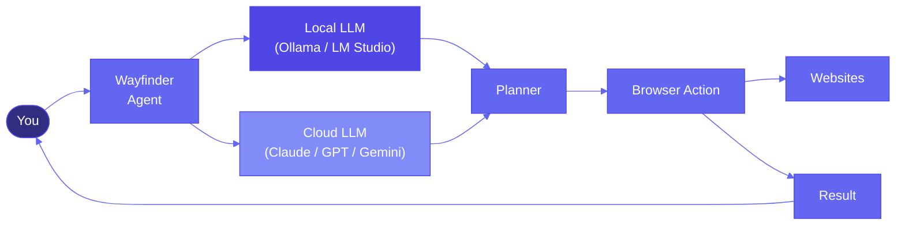
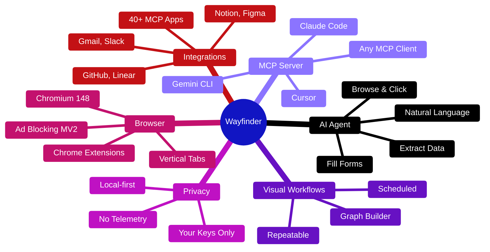
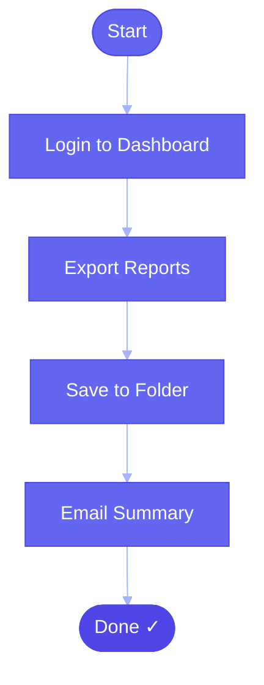
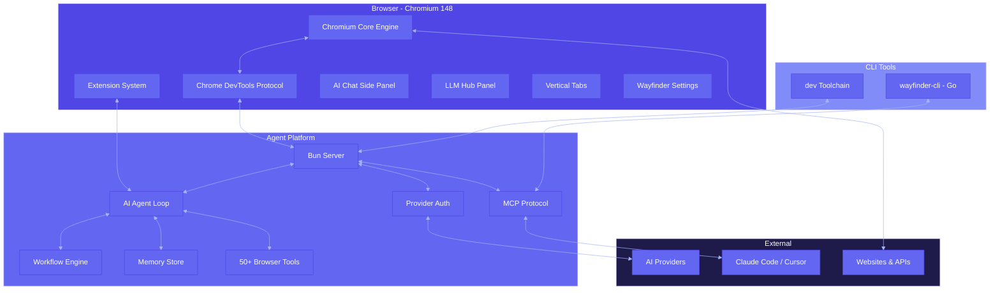

<div align="center">

# Wayfinder

### The open-source browser agent for local AI automation.

[](LICENSE)
[](https://www.chromium.org)
[](https://www.typescriptlang.org/)
[](https://go.dev/)
[](https://bun.sh/)
[](https://python.org)
[](https://github.com/rahulcvwebsitehosting/wayfinder)

**Wayfinder is an open-source, privacy-first browser agent powered by local AI models.**  
Your data never leaves your machine. Your models run on your hardware. You stay in control.

> **How local AI works:** The browser engine (Chromium) does not run LLMs internally. The agent layer — a Bun/TypeScript server running alongside the browser — connects to local model servers like Ollama or LM Studio via their APIs. The LLM handles planning and reasoning; the agent layer executes browser actions through Chrome DevTools Protocol. This means Wayfinder works with any model server you already run.

</div>

---

### How it works



---

## Why Wayfinder?

Wayfinder is not a closed AI product — it's an **open-source platform** that puts you in full control:

| Advantage | Why it matters |
|-----------|---------------|
| **Open Source** (AGPL-3.0) | Audit every line of code. No black boxes. No hidden telemetry. |
| **Local Models First** | Run Ollama, LM Studio, or any local LLM. The agent layer connects to your model server — no dependency on cloud APIs. |
| **Privacy-First** | Your API keys, browsing data, and conversations stay on your machine. Zero data collection. |
| **Self-Hostable** | Deploy the agent server on your own infrastructure. Full autonomy. |
| **Bring Your Own Key** | Use any LLM provider — local or cloud. You choose. |
| **No Vendor Lock-In** | Swap models anytime. No subscriptions, no contracts, no forced upgrades. |

---

## Quick Start


### 1. Download

> **No pre-built installer yet.** This repo contains the full source code. Pre-built binaries will be available on the [Releases page](https://github.com/rahulcvwebsitehosting/wayfinder/releases) once the first build is published.

To build from source, see the [Development](#development) section below.

### 2. Import your Chrome data (optional)

First launch walks you through importing bookmarks, passwords, history, and extensions from Chrome. Everything stays local.

### 3. Connect an AI provider

Wayfinder is **bring-your-own-key**. Add one or more providers in Settings:

| Provider | How to connect |
|----------|---------------|
| **Claude (Anthropic)** | API key from console.anthropic.com |
| **OpenAI (GPT-4o, o3)** | API key from platform.openai.com |
| **Google Gemini** | API key from aistudio.google.com |
| **ChatGPT Pro/Plus** | OAuth login |
| **GitHub Copilot** | OAuth login |
| **Qwen Code** | OAuth login |
| **Azure OpenAI** | Endpoint + API key |
| **AWS Bedrock** | IAM credentials |
| **OpenRouter** | API key |
| **Ollama** | Run locally, connect from settings |
| **LM Studio** | Run locally, connect from settings |

### 4. Start using AI

Press `Cmd+K` (macOS) or `Ctrl+K` (Windows/Linux) to open the command center, or click the Wayfinder icon in the toolbar to open the AI chat side panel.

---

## Features



### 🤖 AI Agent Engine

The core of Wayfinder. Ask the agent to do anything in the browser:

```
"Find all unread emails from GitHub about my PRs and summarize them"
"Go to Amazon, search for mechanical keyboards under $100, and sort by rating"
"Fill out this job application form with my saved profile"
"Monitor this product page for price drops and notify me"
```

The agent uses **50+ browser automation tools** — navigate, click, type, scroll, extract, screenshot, download — all composed automatically.

### 🔌 MCP Server

Wayfinder exposes a **Model Context Protocol (MCP) server** so external AI coding agents can control the browser:

- **Claude Code**: `"Run the test suite in the browser"`
- **Gemini CLI**: `"Take a screenshot of my app and find the CSS bug"`
- **Cursor**: `"Debug this page's console errors"`

Install with:
```bash
# macOS / Linux
curl -fsSL https://github.com/rahulcvwebsitehosting/wayfinder/releases/latest/download/install.sh | bash

# Windows PowerShell
irm https://github.com/rahulcvwebsitehosting/wayfinder/releases/latest/download/install.ps1 | iex
```

Then run `wayfinder-cli init` to link it to your browser.

### 🔁 Visual Workflows



Build drag-and-drop automations that run on a schedule. No coding required.

### 🧠 Persistent Memory

The agent remembers context across conversations — your preferences, past tasks, and important information persist automatically.

### 🧩 LLM Hub

Compare responses from multiple AI providers side-by-side on any webpage.

### 📂 Cowork (Files + Browser)

Combine browser automation with local file operations — research the web, save reports to your folder, edit files, all in one workflow.

### ⏰ Scheduled Tasks

Run agents on autopilot:
- "Check for new job postings every morning at 8 AM"
- "Monitor competitor pricing daily"
- "Generate a weekly report every Friday"

### 🛡️ Privacy & Ad Blocking

- **uBlock Origin** pre-installed
- **Manifest V2** support (stronger ad blocking than Chrome)
- **No telemetry**, no tracking, no data collection
- Your API keys stay on your machine

### 📐 Vertical Tabs

Side-panel tab management that keeps you organized even with 100+ tabs open.

### 🧩 Extension Management & MV2 Support

Wayfinder supports all Chrome extensions out of the box, but unlike Chrome, we **actively preserve Manifest V2** — including full uBlock Origin with advanced blocking capabilities that Google's MV3 API restricts.

**How to install extensions:**
- **Chrome Web Store** — Browse and install directly from the Chrome Web Store
- **Sideload CRX files** — Load unpacked extensions from disk via `chrome://extensions` in developer mode
- **Pre-installed bundles** — uBlock Origin ships with every build; additional bundled extensions are managed through Wayfinder's built-in extension manager in Settings

> **Why MV2 matters:** Google's Manifest V3 deprecates `webRequest` blocking, which powers real ad blockers, privacy tools, and security extensions. By maintaining MV2 support, Wayfinder ensures these tools continue working without compromise.

---

## How It Compares

| | Wayfinder | Chrome | Brave |
|---|:---:|:---:|:---:|
| **Open Source** | ✅ | ❌ | ✅ |
| **Local Models First** | ✅ | ❌ | ❌ |
| **Privacy-First** | ✅ | ❌ | ✅ |
| **Self-Hostable** | ✅ | ❌ | ❌ |
| Built-in AI Agent | ✅ | ❌ | ❌ |
| MCP Server | ✅ | ❌ | ❌ |
| Visual Workflows | ✅ | ❌ | ❌ |
| Bring Your Own Keys | ✅ | ❌ | ✅ |
| Ad Blocking (MV2) | ✅ | ❌ | ✅ |
| Chrome Extension Compat | ✅ | ✅ | ✅ |

**Key takeaway:** Wayfinder is the only open-source browser agent purpose-built for local AI — you keep your data, you choose your models, you own the stack.

---

## Architecture



### Repository Structure

```
wayfinder/
├── packages/wayfinder/                 # Chromium fork + build system
│   ├── chromium_patches/               # Patches applied to Chromium source
│   ├── build/                          # Python build CLI
│   ├── build_go/                       # Go build CLI (production)
│   └── resources/                      # Icons, entitlements, signing configs
│
└── packages/wayfinder-agent/           # Agent platform (TypeScript / Go)
    ├── apps/
    │   ├── server/                     # Bun server - AI agent loop + MCP
    │   ├── agent/                      # WXT browser extension (React)
    │   ├── cli/                        # Go CLI tool
    │   └── eval/                       # Benchmark framework
    │
    └── packages/
        ├── agent-sdk/                  # npm: @wayfinder/agent-sdk
        ├── cdp-protocol/               # CDP type bindings
        └── shared/                     # Shared constants & types
```

| Component | Language | What it does |
|-----------|----------|-------------|
| `packages/wayfinder/` | C++, Python, Go | Chromium fork — the browser itself with patches, build system, and signing |
| `apps/server/` | TypeScript (Bun) | MCP server + AI agent loop — connects to the browser via CDP, runs the agent, exposes MCP tools |
| `apps/agent/` | TypeScript (React, WXT) | Browser extension — new tab page, side panel chat, onboarding, settings UI |
| `apps/cli/` | Go | CLI tool — control Wayfinder from terminal or AI coding agents |
| `packages/agent-sdk/` | TypeScript | Node.js SDK for browser automation with natural language |
| `packages/cdp-protocol/` | TypeScript | Type-safe Chrome DevTools Protocol bindings |
| `packages/shared/` | TypeScript | Shared constants, provider types, and common code |

---

## Development

### Prerequisites

| Tool | Version | Purpose |
|------|---------|---------|
| [Bun](https://bun.sh) | 1.3.6+ | JavaScript runtime for the agent platform |
| [Go](https://go.dev) | 1.24+ | CLI tooling |
| [Python](https://python.org) | 3.12+ | Chromium build system |
| [Node.js](https://nodejs.org) | — | Used by Bun-compatible tooling |

### Agent Platform (TypeScript / Go)

```bash
# Clone the repo
git clone https://github.com/rahulcvwebsitehosting/wayfinder.git
cd wayfinder

# Navigate to the agent platform
cd packages/wayfinder-agent

# Install dependencies
bun install

# Set up environment
cp .env.example .env
# Edit .env with your settings

# Start the development server
bun run dev:watch
```

This starts the agent server, MCP server, and browser extension in watch mode.

### Browser Development (C++ / Chromium)

Building the browser from source requires the full Chromium toolchain (~100 GB disk, 3-5 hours):

```bash
# Install the build CLI
pip install -e packages/wayfinder/

# Provision Chromium source
python scripts/ci/setup_chromium.py \
  --chromium-root /path/to/chromium_root \
  --step checkout

python scripts/ci/setup_chromium.py \
  --chromium-root /path/to/chromium_root \
  --step sync

# Build
wayfinder build \
  --config build/config/release.windows.yaml \
  --chromium-src /path/to/chromium_root/src
```

> Most contributors focus on the agent platform (TypeScript/Go). Browser development is only needed for deep Chromium-level changes.

---

## Chromium Maintenance & Update Strategy

Forking Chromium is a long-term commitment. Here's how Wayfinder manages it:

**Patch system:** All changes to Chromium live in `chromium_patches/` as structured patch files organized by feature layer. Patches are applied deterministically by the build CLI on top of a clean Chromium checkout — no permanent fork branch to maintain.

**Rebase strategy:**
- Each Wayfinder release pins a specific Chromium tag (e.g., `148.0.7778.97`)
- When rebasing to a newer Chromium version, patches are reapplied via the build system
- Patch conflicts are surfaced at apply time, not buried in merge commits
- The `series_patches` module handles upstream patches (ungoogled-chromium, etc.) separately from Wayfinder-specific patches, making conflict resolution easier

**Update cadence:**
- **Security patches:** Chromium releases critical security fixes monthly. Each new Chromium tag is evaluated for inclusion.
- **Feature updates:** Major Chromium versions are adopted when the upstream improvements align with Wayfinder's roadmap.
- **Extension compatibility:** Chromium's extension API changes are monitored to ensure existing patches remain compatible.

**Risk acknowledgment:** Maintaining a Chromium fork means staying on top of every CVE, API deprecation, and build system change. This is a known cost of providing a truly independent browser. Contributions and community testing are essential to keeping the fork healthy.

---

## Downloading Pre-built Releases

Pre-built installers will be published on the [Releases page](https://github.com/rahulcvwebsitehosting/wayfinder/releases) once available. Each installer will include:

- The full Wayfinder browser (Chromium 148)
- The built-in AI agent engine
- The MCP server
- uBlock Origin with MV2 support
- All pre-installed extensions

In the meantime, you can run the agent platform directly without building Chromium (see [Development](#development)).

---

## FAQ

**Can I run Wayfinder entirely offline with local models?** Yes. Connect Ollama or LM Studio and you never need an internet connection for AI — just for the websites you browse.

**Is Wayfinder truly open source?** Yes, AGPL-3.0. Every line of code is public. No proprietary components, no hidden telemetry, no backdoors.

**How is this different from Browser Use or OpenAI Operator?** Those are cloud-dependent SaaS products. Wayfinder is a self-hostable, open-source browser agent that runs on your own hardware with your own models.

**Do I need an API key?** Only if you use cloud providers. With local models (Ollama, LM Studio), no API key is needed.

**Is my data sent to any server?** No. Your API keys, browsing data, and conversations stay on your machine. Network requests are local to your LLM or to the websites you visit.

**Can I use Chrome extensions?** Yes. Wayfinder is a Chromium fork and supports all Chrome extensions. uBlock Origin is pre-installed with Manifest V2 support.

**Can I run Wayfinder headlessly?** Yes. Supports headless mode for automated workflows and CI pipelines. Use `wayfinder-cli` to launch in headless mode.

---

## Contributing

Contributions are welcome! See [CONTRIBUTING.md](CONTRIBUTING.md) for detailed guidelines.

- [Report a bug](https://github.com/rahulcvwebsitehosting/wayfinder/issues/new)
- [Request a feature](https://github.com/rahulcvwebsitehosting/wayfinder/issues/new)
- [Submit a pull request](https://github.com/rahulcvwebsitehosting/wayfinder/compare)

**Quick start for contributors:**
```bash
# Fork the repo, then:
git clone https://github.com/YOUR_USERNAME/wayfinder.git
cd wayfinder/packages/wayfinder-agent
bun install
bun run dev:watch
```

*Note: The issue tracker and releases are at [github.com/rahulcvwebsitehosting/wayfinder](https://github.com/rahulcvwebsitehosting/wayfinder).*

---

## License

**AGPL-3.0** — See [LICENSE](LICENSE) for details.

Wayfinder is built on [Chromium](https://www.chromium.org/) and incorporates patches from [ungoogled-chromium](https://github.com/ungoogled-software/ungoogled-chromium).

---

<div align="center">

**The open-source browser agent for local AI automation.**

[Get Started](#quick-start) · [Download](#download) · [Contribute](#contributing) · [Report Issue](https://github.com/rahulcvwebsitehosting/wayfinder/issues)

</div>
